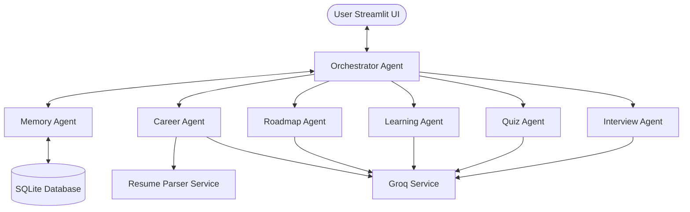
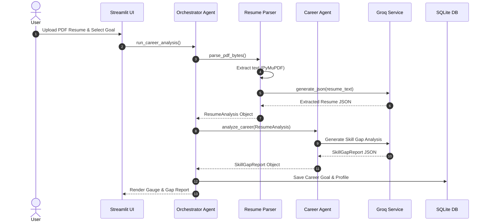
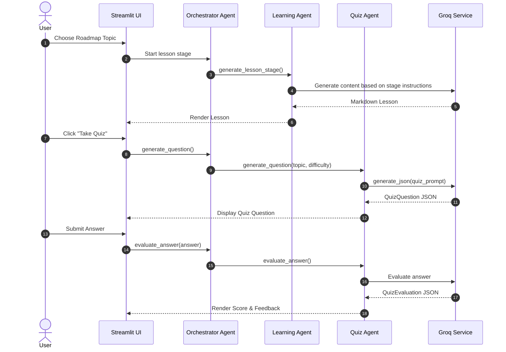

# CareerPilot AI 🚀

> **Your AI-powered career mentor** — Analyze skill gaps, build personalized roadmaps, learn interactively, practice mock interviews, and track your career journey.

---

## 🎯 Architecture Overview

CareerPilot AI is built on a **multi-agent orchestrator architecture** where a master coordinator delegates workflows to specialist agents. The entire platform is powered by the **Groq API** for high-speed LLM generation, backed by a persistent SQLite database for memory.



---

## ⚡ Workflows & Interactive Flows

### 1. Career Assessment & Skill Gap Detection
This workflow extracts text from your PDF resume, compares your experience against your target role, and automatically creates a roadmap.



### 2. Interactive Lesson & Quiz Evaluation
This flow delivers an 8-stage interactive lesson (Overview to Resources) and tests your learning with adaptive quizzes.



---

## 🛠️ Detailed Features

| Module | Features & Capabilities |
|:---|:---|
| **🎯 Career Assessment** | Contextual skill extraction, educational & experience analysis, readiness percentage gauge, and project recommendations. |
| **🗺️ Roadmap Generation** | Generates adaptive, month-by-month timelines. Adapts in real-time as you complete lessons and quizzes. |
| **📚 Interactive Learning** | Learns via real-world analogies, code snippets, practical tasks, mini-projects, and reflection. |
| **🧠 Adaptive Quizzes** | Generates MCQs, short-answer, and coding questions. Evaluates semantic correctness and guides improvement. |
| **🎤 Mock Interviews** | Conducts mock technical, behavioral, system design, resume-based, or coding interviews. Provides multi-dimension scorecards. |
| **📊 Progress Tracking** | Live visualization of streaks, quiz scores, roadmap progress, and skill mastery using Plotly. |

---

## 🚀 Tech Stack

- **LLM Engine**: Groq API Client (default: `meta-llama/llama-4-scout-17b-16e-instruct`)
- **Frontend & UI**: Streamlit
- **Database**: SQLite (SQLAlchemy / direct database connector)
- **PDF Extraction**: PyMuPDF (`fitz`)
- **Validation**: Pydantic v2 (safeguarded against LLM missing or null responses)
- **Visuals & Charts**: Plotly, Pandas

---

## 📦 Setup & Installation

### 1. Clone & Configure
```bash
git clone <your-repository-url>
cd careerpilot_ai
```

### 2. Configure Environment Variables
Copy `.env.example` to `.env` and fill in your Groq API Key:
```bash
cp .env.example .env
```
Inside `.env`:
```env
#GEMINI_API_KEY= gemini_api_key or use other api keys
GROQ_API_KEY=gsk_your_api_key_here
```

### 3. Install Dependencies
```bash
pip install -r requirements.txt
```

### 4. Launch CareerPilot AI
```bash
streamlit run app.py
```

---

## ⚙️ Environment Configurations

Configure custom settings inside `.env`:
you can setup with GOOGLE GEMINI MODELS OR OTHER MODELS FOR THIS PROJECT
with the high consumption of Google api model , i switched it to ** GROQ model **

| Key | Description | Default |
|:---|:---|:---|
| `GROQ_API_KEY` | Your Groq Cloud API Key (required) | — |
| `GROQ_MODEL` | The LLM model used for chat/generation | `meta-llama/llama-4-scout-17b-16e-instruct` |
| `GROQ_TEMPERATURE` | Generation creativity scale (0.0 to 1.0) | `0.7` |
| `GROQ_MAX_TOKENS` | Maximum tokens to generate | `8192` |
| `DB_PATH` | SQLite database file location | `careerpilot.db` |

---

## 📂 Project Structure

```
careerpilot_ai/
├── app.py                    # Streamlit app entry-point
├── config.py                 # Core configurations & defaults
├── requirements.txt          # Python dependencies
├── .env.example              # Configuration template
├── .gitignore                # File exclusions
│
├── agents/                   # Multi-agent specialists
│   ├── orchestrator.py       # Master orchestrator agent
│   ├── career_agent.py       # Career analysis & skill gaps
│   ├── interview_agent.py    # Live mock interview simulator
│   ├── learning_agent.py     # Interactive tutor logic
│   ├── roadmap_agent.py      # Adapting roadmap planner
│   ├── quiz_agent.py         # Quiz builder & evaluator
│   └── memory_agent.py       # User history & memory manager
│
├── database/                 # Persistence layer
│   ├── sqlite.py             # SQLite helper and schemas
│   └── models.py             # Pydantic schemas & records
│
├── services/                 # External services
│   ├── gemini_service.py     # Centralized Groq API wrapper (renamed wrapper)
│   ├── resume_parser.py      # Resume PDF reader
│   └── progress_service.py   # Stats tracker & streak calculator
│
├── pages/                    # Streamlit pages
│   ├── 1_Dashboard.py        # Core student workspace
│   ├── 2_Career_Assessment.py# Goals, resume parsing & timelines
│   ├── 3_Learning.py         # Interactive study lessons
│   ├── 4_Interview.py        # Mock interview terminal
│   └── 5_Progress.py         # Student statistics charts
│
└── utils/                    # Prompts & helpers
    ├── prompts.py            # Master prompt templates
    └── helpers.py            # Utility methods
```

---

## 🤝 License
Licensed under the [MIT License](LICENSE).
